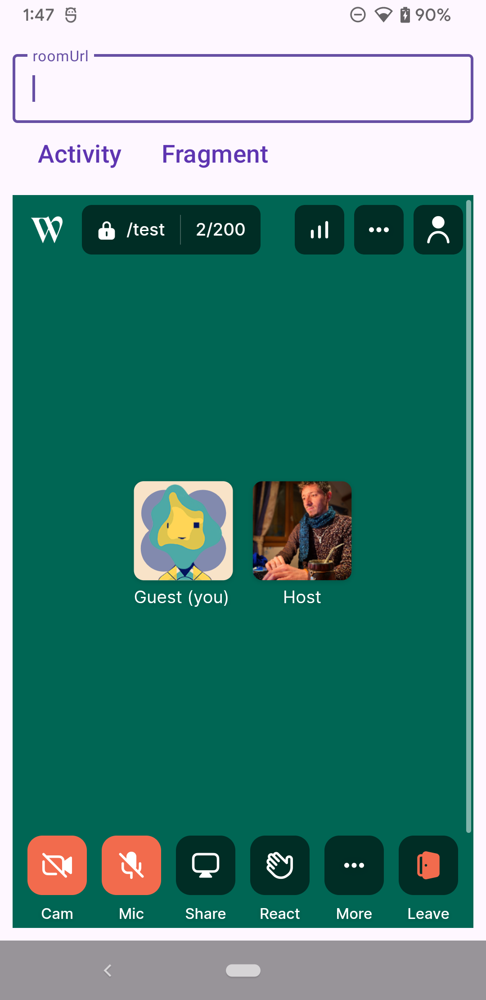
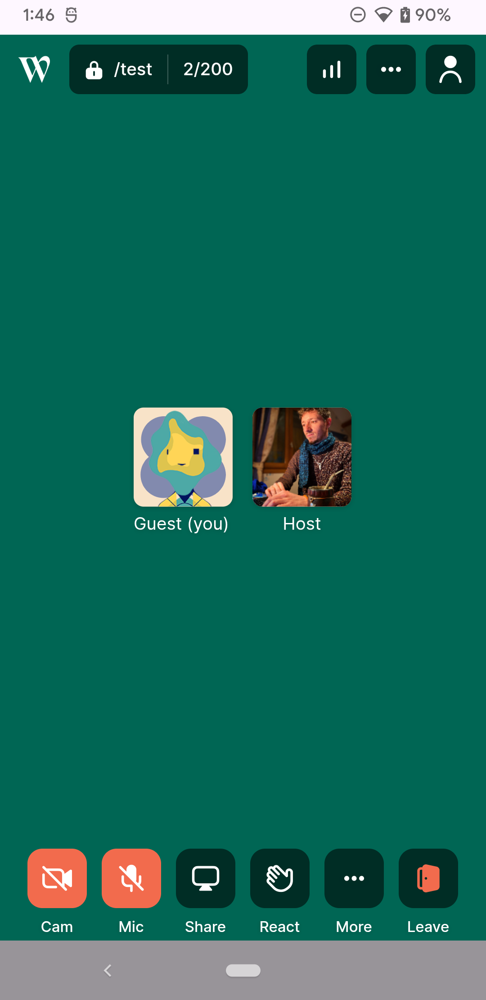
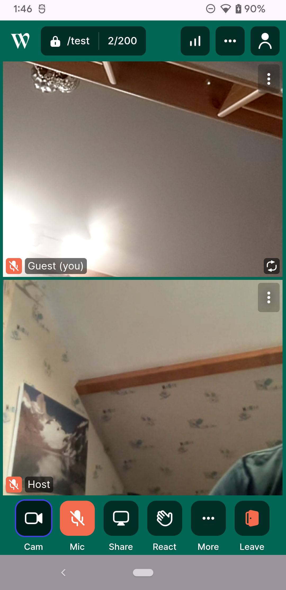

# Whereby WebView Demo - Android

## Overview

This project is a demo app showcasing how to embed [Whereby](https://whereby.com/) in a `WebView` within a native Android application using either an Activity or Fragment. It demonstrates proper handling of media permissions, file downloads, and uploads. More information is available in the [Whereby documentation](https://docs.whereby.com/).

| Initial screen | Fragment | Activity 1 | Activity 2 |
|-------------|-------------|-------------|-------------|
|  |  |  |  |

## Prerequisites

- Android Studio (latest stable version)
- Android SDK 24 or higher
- A Whereby room URL or a web app that embeds Whereby

## Features

- Load any Whereby [room URL](https://whereby.com/information/select-product) or app that embeds Whereby.
- Full handling of runtime permissions for:
  - Microphone access
  - Camera access
- Handle file uploads and downloads.

## Installation

1. Clone this repository:
   ```sh
   git clone https://github.com/whereby/android-webview-demo.git
   cd android-webview-demo
2. Open the project in Android Studio.
3. Let Gradle sync and resolve dependencies.
4. Set the Whereby room URL in the `MainActivity`.
5. Build and run the app on an emulator or a physical device.

## Usage

1. Launch the app.
2. Enter a valid URL in the input field.
3. Tap either the "Activity" or "Fragment" button.

## Code Overview

Declare these permissions in AndroidManifest.xml:
```
<uses-permission android:name="android.permission.RECORD_AUDIO" />
<uses-permission android:name="android.permission.CAMERA" />
<uses-permission android:name="android.permission.MODIFY_AUDIO_SETTINGS" />
```
 
If loading a Whereby meeting room URL, you can combine [URL parameters](https://docs.whereby.com/whereby-101/customizing-rooms/using-url-parameters) to customize the user experience. We recommend using `skipMediaPermissionPrompt`. 

## Considerations

When embedded in a WebView, the user may be disconnected from the room if the app is moved to the background.

## Resources

- [Android WebView Documentation](https://developer.android.com/reference/android/webkit/WebView)
- [Request runtime permissions](https://developer.android.com/training/permissions/requesting)

## License

This project is licensed under the MIT License. See `LICENSE` for details.


